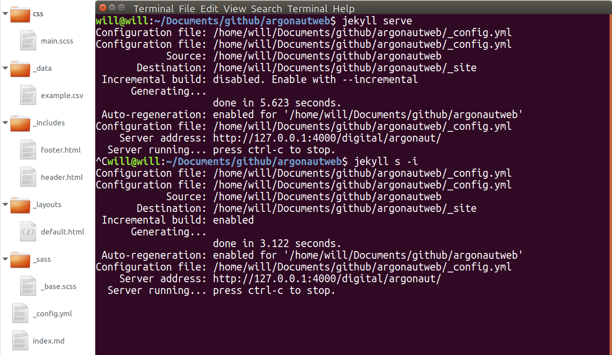

# Developing with Jekyll

Jekyll can also be used on your local machine with or without themes to generate any type of web site.
Create a repository on GitHub for your project, pull down the up-to-date code, and use Jekyll's built in development server to work on your laptop.  

Basically, Jekyll provides a stack of web development tools that operate over a directory of text files to output a site.
You could install and use these tools separately, but bundling them into a single app makes the process simpler and more powerful.
The Jekyll stack includes: 
- Ruby (core and extensions)
- kramdown (Markdown for base content)
- Liquid (templating)
- Sass (css preprocessing)
- YAML (data, config)

There is not a GUI, Jekyll uses a handful of terminal commands to do everything. 
Create a new project with `jekyll new project-name` and start the local development server with `jekyll serve`.

> Although Jekyll supports [plugins](https://jekyllrb.com/docs/plugins/), gh-pages only allows a few standard ones, so avoid them if you want to use the automatic build.

# Project Directory Tour

A Jekyll project is simply a directory of files, the source code for building a web site. 
A few directories have specialized uses for Jekyll and are denoted with an `_` underscore beginning the name.

- `example-site`: Your Jekyll project is a Git repository. The top level contains configurations and files that will become root level pages in your site. Edit the overall site settings in `_config.yml`. Changes to `_config.yml` are not automatically refreshed during `jekyll serve`, you have to stop the server and restart.
    - `_layouts`: The basic templates for complete web pages, generally constructed with Liquid includes. They are called by YAML front matter on each page or post.
    - `_includes`: Modular chunks of HTML that can be called into a page layout by Liquid. For example `` in a page layout would add the include `head.html` from the `_includes` directory.
    - `_posts`: Files in this directory will become blog post-like objects. They always have a date and title in the file name. If your site isn't a blog, you don't have to add a `_posts` directory. Other directories can be designated [Collections](https://jekyllrb.com/docs/collections/) to create regular groups of pages with properties similar to Posts.
    - `_sass`: Contains the modular `.scss` partials that will be pulled into your main CSS for the site. File names should start with an underscore.
    - `_data`: YAML, JSON, and CSV files in this directory will be exposed as variables to the build engine so that values can be called into pages using Liquid. You can use this data to create pages, make menus, or fill content anywhere in your site.
    - `css` / `assets` / `images`: Directories without an underscore are copied to the generated site. One should contain a base SCSS file used to compile the partials into the site's CSS file. Any file with no YAML front matter will also be simply copied without processing, for example images or java script libraries. 
    - `_site`: This is the built out version of your new static site. Never modify files in this directory. It will be completely deleted and rebuilt with each `jekyll serve` or `jekyll build`. If you want to deploy your site to a static web host, copy this directory to your server!

For example, check out the repository used to build this site, [go-go-ghpages](https://github.com/evanwill/go-go-ghpages).
Fork it and start editing file to see how it works!

# Basic Workflow

Set up a repository on GitHub and active gh-pages.

- Git clone or pull the project repository
- Jekyll serve, or `jekyll s -i`
- Edit files and test locally
- Commit changes
- Git push to GitHub
- Gh-pages will automatically rebuild!
